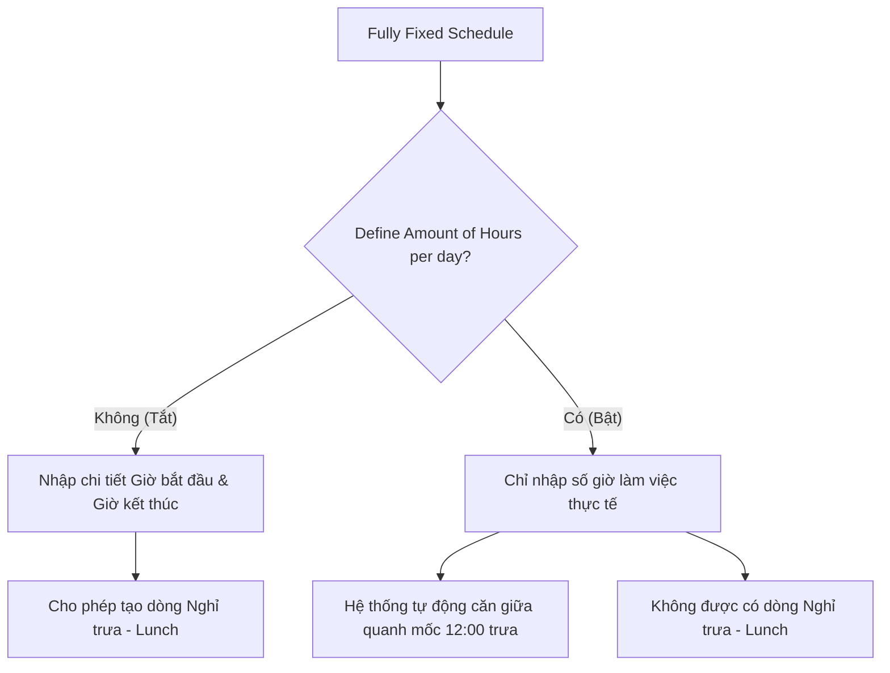

# Hướng dẫn thiết lập Lịch làm việc (resource.calendar) trên Odoo

Tài liệu này hướng dẫn chi tiết cách thiết lập và cấu hình **Lịch làm việc (Working Schedules)** thuộc mô-đun Quản lý Nguồn lực (`resource.calendar`) trong hệ thống Odoo.

Lịch làm việc là cơ sở để tính toán bảng công (Work Entries), ngày nghỉ (Time Off), giờ làm thêm (Overtime) và phân bổ công việc cho nhân viên.

---

## 1. Các bước thiết lập cơ bản

Để tạo hoặc chỉnh sửa Lịch làm việc, truy cập vào menu **Lịch làm việc (Working Schedules)**.

### Thông tin chung (Header & General Info)
1.  **Tên lịch làm việc (Working Time)**: Đặt tên mô tả rõ ràng ca làm việc (Ví dụ: `Giờ Hành Chính - 40h/tuần`, `Lịch linh hoạt 30h/tuần`).
2.  **Kiểu lịch trình (Schedule Type)**: Chọn một trong hai loại lịch làm việc tùy theo nhu cầu của doanh nghiệp:
    *   **Flexible (Linh hoạt)**: Chỉ cần định nghĩa số giờ làm việc trung bình mỗi ngày và tổng số giờ làm việc mỗi tuần mà không cần thiết lập chi tiết khung giờ.
    *   **Fully Fixed (Cố định hoàn toàn)**: Định nghĩa chi tiết ngày làm việc, các buổi trong ngày (Sáng, Trưa, Chiều, Cả ngày) cùng với giờ cụ thể của từng buổi.
3.  **Múi giờ (Timezone)**: Chọn múi giờ chính xác áp dụng cho lịch (Ví dụ: `Asia/Ho_Chi_Minh`).
    :::important
    Múi giờ cực kỳ quan trọng. Nếu múi giờ của lịch làm việc khác với múi giờ trên trình duyệt của người thiết lập hoặc múi giờ của nhân viên, Odoo sẽ hiển thị cảnh báo lệch múi giờ. Hãy đảm bảo múi giờ được chọn đồng bộ để tránh sai lệch khi tính toán thời gian nghỉ phép hoặc chấm công.
    :::
4.  **Công ty (Company)**: Chọn công ty tương ứng. Nếu để trống, lịch này sẽ hiển thị và áp dụng được cho tất cả công ty (trong môi trường đa công ty - Multi-company).
5.  **Yêu cầu Toàn thời gian (Required Full Time / Full Time Equivalent)**: Số giờ làm việc tiêu chuẩn trong tuần để được coi là làm việc toàn thời gian (mặc định kế thừa từ lịch chuẩn của công ty, ví dụ: `40.00` giờ/tuần).
6.  **Tỷ lệ thời gian làm việc (Work Time Rate)**: Hệ thống tự động tính toán tỷ lệ phần trăm dựa trên tổng số giờ làm việc thực tế chia cho số giờ yêu cầu toàn thời gian.
    *   Ví dụ: Nếu lịch thiết lập có tổng cộng 40 giờ/tuần và Yêu cầu Toàn thời gian là 40 giờ/tuần, tỷ lệ sẽ là `100%`. Nếu lịch làm việc chỉ có 20 giờ/tuần, tỷ lệ là `50%` (Part-time).

---

## 2. Chi tiết cấu hình các loại Lịch trình

### 2.1. Kiểu lịch trình Linh hoạt (Flexible)
Chế độ này áp dụng cho những nhân sự làm việc không cố định giờ giấc hoặc ca làm việc linh hoạt tự do, chỉ cần đảm bảo đủ số giờ tích lũy trong tuần/ngày.

Khi chọn **Flexible**, bạn chỉ cần điền hai thông tin đơn giản:
*   **Giờ trung bình/Ngày (Avg - `hours_per_day`)**: Số giờ làm việc trung bình dự kiến của một ngày (Ví dụ: `8:00` giờ/ngày).
*   **Tổng số giờ/Tuần (Total - `hours_per_week`)**: Tổng số giờ làm việc bắt buộc trong một tuần (Ví dụ: `40:00` giờ/tuần).

:::note
Ở chế độ Flexible, Odoo sẽ ẩn hoàn toàn bảng nhập chi tiết giờ làm việc hàng ngày (Working Hours) để tối giản hóa giao diện nhập liệu.
:::

---

### 2.2. Kiểu lịch trình Cố định hoàn toàn (Fully Fixed)
Áp dụng cho nhân sự làm việc theo giờ hành chính hoặc ca kíp cố định có giờ bắt đầu và kết thúc rõ ràng.

Khi chọn **Fully Fixed**, bạn có thêm các tùy chọn cấu hình nâng cao sau:

#### A. Cấu hình theo Thời lượng (Define Amount of Hours per day)
*   **Khi Tắt (Mặc định - Fixed Attendance)**: Lịch làm việc được xác định bằng giờ bắt đầu và giờ kết thúc cụ thể cho từng dòng ca. Cho phép thêm các dòng nghỉ trưa (day_period = `lunch`).
*   **Khi Bật (Duration-based Attendance)**: Lịch làm việc chỉ xác định bằng tổng số giờ làm việc thực tế trong ngày, không cần nhập giờ cụ thể.

*   **Cách Odoo tự động căn chỉnh khi bật chế độ này**: Hệ thống lấy mốc **12:00 trưa (PM)** làm trung tâm và tự động chia đều số giờ làm việc:
    *   *Cả ngày (Full Day):* Ca làm việc `8` giờ sẽ tự tính từ **08:00 AM** đến **04:00 PM**.
    *   *Buổi sáng (Morning):* Ca sáng `4` giờ sẽ kết thúc lúc 12:00 PM (từ **08:00 AM** đến **12:00 PM**).
    *   *Buổi chiều (Afternoon):* Ca chiều `4` giờ sẽ bắt đầu từ 12:00 PM (từ **12:00 PM** đến **04:00 PM**).

#### B. Lịch làm việc chu kỳ 2 tuần (2 Week's Calendar)
Áp dụng cho doanh nghiệp có ca làm việc xoay vòng xen kẽ (Ví dụ: Tuần 1 làm việc Thứ Bảy; Tuần 2 nghỉ Thứ Bảy).
*   **Cách kích hoạt**: Nhấp nút tick ở phần **2 Week's Calendar**.
*   **Sự thay đổi giao diện**: Bảng giờ làm việc được chia làm hai tab riêng biệt:
    1.  **Week 1 Working Hours (Giờ làm việc Tuần 1 / Tuần lẻ)**
    2.  **Week 2 Working Hours (Giờ làm việc Tuần 2 / Tuần chẵn)**
*   Hệ thống có dòng giải thích động ở đầu mỗi tab hiển thị tuần hiện tại thuộc tuần chẵn hay lẻ để bạn dễ đối chiếu tại thời điểm cấu hình.

---

## 3. Hướng dẫn nhập liệu bảng Giờ làm việc (Working Hours)
*(Chỉ hiển thị khi chọn kiểu lịch trình Fully Fixed)*

| Tên cột | Ý nghĩa & Cách nhập |
| :--- | :--- |
| **Thứ tự (sequence)** | Dùng để sắp xếp thứ tự ca làm việc (kéo thả biểu tượng đầu dòng). |
| **Tên (Name)** | Mô tả ngắn gọn ca làm việc (Ví dụ: `Thứ Hai Sáng`, `Thứ Hai Chiều`). |
| **Ngày trong tuần (Day of Week)** | Chọn thứ trong tuần từ Thứ Hai đến Chủ Nhật. |
| **Buổi làm việc (Day Period)** | Chọn loại buổi: Sáng (`Morning`), Trưa/Nghỉ trưa (`Break`), Chiều (`Afternoon`), hoặc Cả ngày (`Full Day`). |
| **Số giờ làm việc (Duration)** | *Chỉ xuất hiện khi bật "Cấu hình theo Thời lượng"*. Nhập tổng số giờ làm việc thực tế cho ca đó. |
| **Giờ bắt đầu (Work from)** | *Chỉ xuất hiện khi tắt "Cấu hình theo Thời lượng"*. Giờ bắt đầu làm việc. |
| **Giờ kết thúc (Work to)** | *Chỉ xuất hiện khi tắt "Cấu hình theo Thời lượng"*. Giờ kết thúc làm việc. |
| **Thời lượng ngày (Duration in days)** | Hệ thống tự tính toán số ngày công tương ứng (ví dụ: `0.5` ngày cho ca nửa ngày, hoặc `1.0` ngày cho ca cả ngày). |
| **Số tuần (Week Number)** | *Chỉ xuất hiện ở chế độ lịch 2 tuần*. Tự động gán là `First` (Tuần 1) hoặc `Second` (Tuần 2) dựa theo tab bạn đang nhập liệu. |

:::tip
**Mẹo nhập giờ nhanh (Float Time)**:
Odoo sử dụng định dạng thời gian số thập phân. Tuy nhiên, tại các cột giờ bắt đầu (`Work from`) và giờ kết thúc (`Work to`), bạn có thể nhập trực tiếp định dạng giờ phút bình thường (ví dụ: gõ `08:30` hoặc `13:15`), hệ thống sẽ tự động quy đổi thành số thập phân tương ứng (`8.50` hoặc `13.25`).
:::
